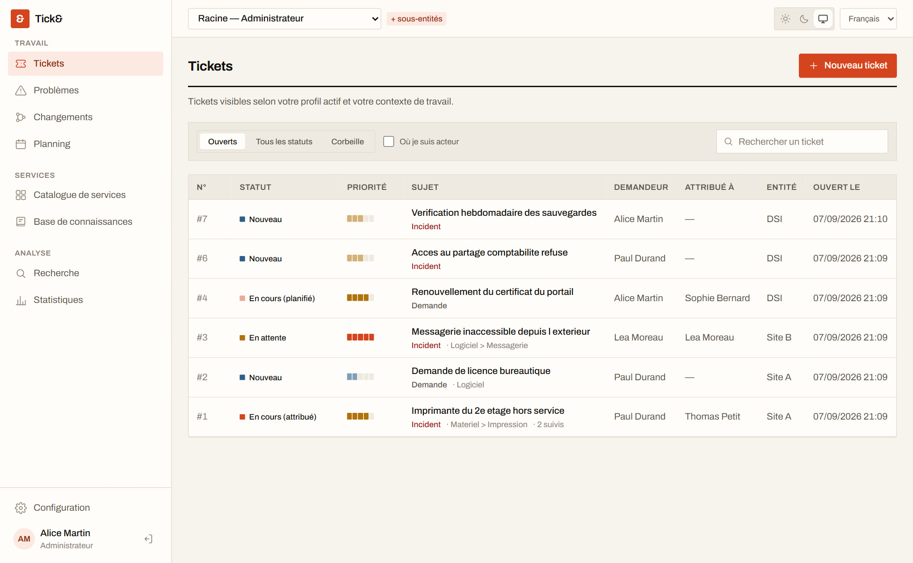
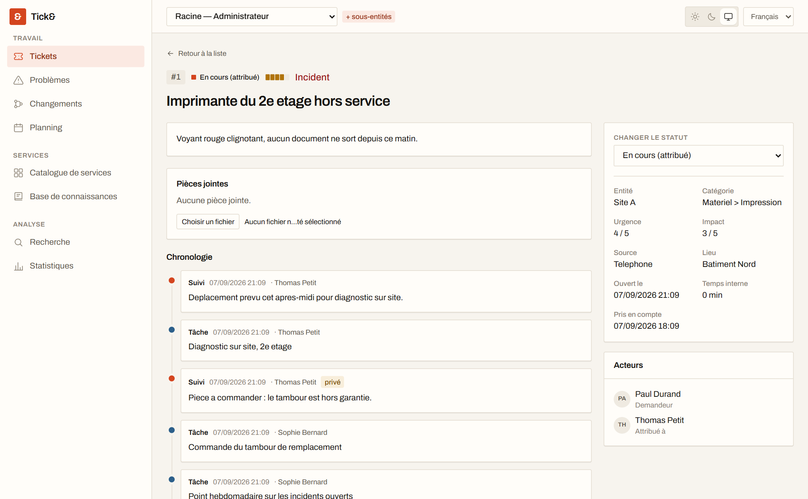
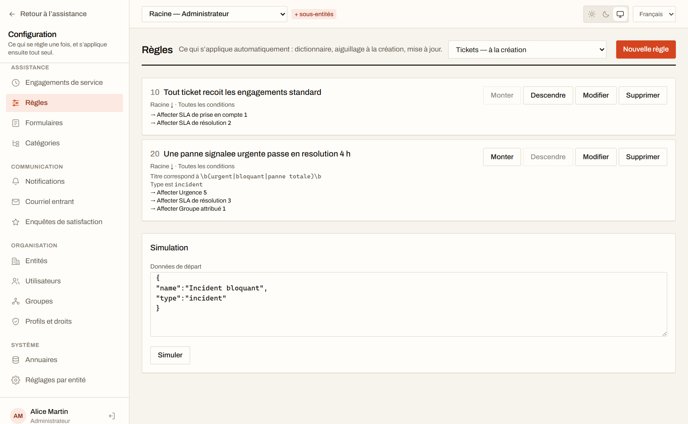
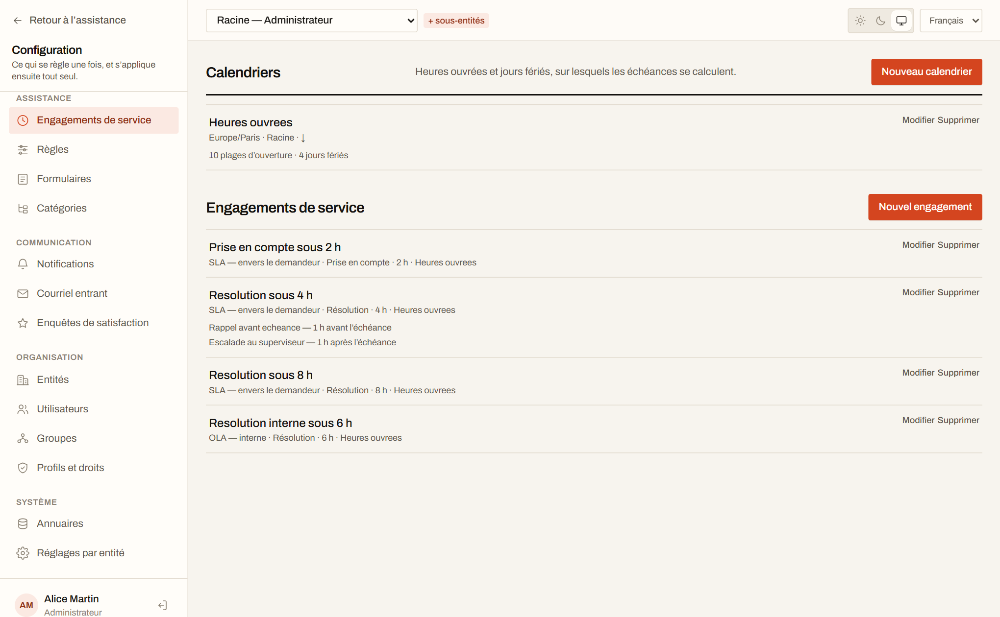
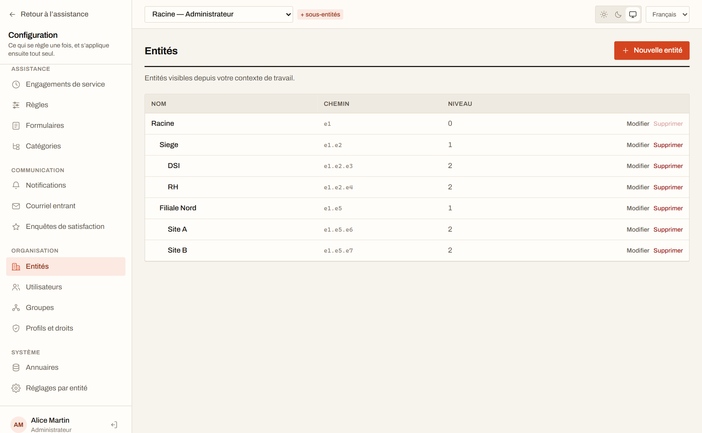

[English](README.md) · **Français**

# Tick&

**Outil de ticketing ITSM, libre et auto-hébergeable.** Incidents, demandes, problèmes,
changements, engagements de service, règles d'automatisation, notifications, base de
connaissances, formulaires de catalogue, enquêtes de satisfaction et portail self-service — un
seul outil, à l'échelle de toute une organisation. La gestion de parc est délibérément hors
périmètre.

[](LICENSE)
[](https://github.com/tick0001/tick/actions/workflows/ci.yml)

**[tickand.fr](https://tickand.fr)** · **[Essayer la démonstration](https://demo.tickand.fr)** —
connectez-vous avec `sophie` / `tick`. Tout est remis à zéro à chaque heure.



---

## Ce que ça fait

**Multi-organisation, appliqué par la base.** Les entités forment un arbre, et le cloisonnement
repose sur le Row-Level Security de PostgreSQL — pas sur des conditions `WHERE` que l'on peut
oublier d'écrire. Un droit est un triplet objet × action × portée, et l'absence de ligne vaut
refus.

**Le cycle ITIL complet.** Tickets, problèmes et changements partagent un socle commun : acteurs,
chronologie unifiée, tâches, solutions, validations, liens entre objets, promotion d'un incident en
problème.



**Ce qui fait tourner un centre de services.** Calendriers ouvrés et engagements avec escalade,
moteur de règles avec simulateur, notifications par courriel et collecteur entrant, base de
connaissances et FAQ publique, formulaires de catalogue avec conditions d'affichage, enquêtes de
satisfaction, planning, statistiques et tableaux de bord, exports CSV et PDF.





**Extensible sans forker.** Les plugins se chargent dans le processus, déclarent leurs permissions
dans un manifeste versionné, obtiennent leur propre schéma PostgreSQL, et se retirent sans laisser
de traces. Voir le [SDK](docs/15-sdk-plugins.md).

**Français et anglais** dès le départ, interface comme courriels.



## Déployer

```bash
git clone https://github.com/tick0001/tick.git && cd tick
cp .env.production.example docker/.env    # puis remplir : secrets, adresses, SMTP
docker compose -f docker/compose.production.yaml up -d

# Créer le premier administrateur — sans lui, personne ne peut se connecter.
docker compose -f docker/compose.production.yaml run --rm \
  -e TICK_ADMIN_PASSWORD='…' api node dist/cli/initialiser.js
```

Le fichier d'environnement va dans `docker/`, à côté du fichier compose : c'est là que Compose le
cherche, et non à la racine du dépôt.

Les images sont tirées de `ghcr.io/tick0001/tick-api` et `ghcr.io/tick0001/tick-web`. Fixer une
version avec `TICK_VERSION` plutôt que suivre `latest`, pour qu'une montée de version reste une
décision.

Tick& attend derrière un terminateur TLS — Caddy, Traefik, nginx — qui présente le certificat.

Le [guide d'installation](docs/14-installation.md) détaille les secrets à générer, la rotation
**obligatoire** du mot de passe du rôle applicatif, les sauvegardes et les mises à jour.

Pas de conteneurs autorisés sur vos serveurs ? Les guides d'installation nue couvrent le même
déploiement depuis les archives de version, sur [Linux](docs/16-installation-linux.md) et sur
[Windows Server](docs/17-installation-windows.md).

## Essayer en local

Prérequis : Node 22 ou plus, pnpm 11, Docker.

```bash
pnpm install
cp .env.example .env
pnpm services:up      # PostgreSQL, Redis, Mailpit, OpenLDAP
pnpm db:migrate       # schéma, déclencheurs, politiques RLS
pnpm db:seed          # ⚠ jeu de démonstration — vide les tables avant d'écrire
pnpm dev              # API sur :3000, interface sur :5173
```

Puis <http://localhost:5173>, avec `sophie` / `tick` — le compte qui voit le plus de choses sans
être administrateur. Les courriels partent vers Mailpit, sur <http://localhost:8025>.

`db:seed` sert à **essayer**, jamais à installer : il tronque toutes les tables. Pour une vraie
installation, c'est `initialiser` qui pose le strict minimum.

<details>
<summary>Comptes de démonstration — mot de passe commun <code>tick</code></summary>

Chacun illustre un cas que le modèle d'entités doit savoir traiter.

| Compte      | Habilitations                                       | Ce qu'il démontre                                             |
| ----------- | --------------------------------------------------- | ------------------------------------------------------------- |
| `admin`     | Administrateur sur Racine, récursif                 | Accès complet à l'arborescence                                |
| `sophie`    | Superviseur sur Filiale Nord, récursif              | Une branche entière, sans voir le Siège                       |
| `thomas`    | Technicien sur Site A, non récursif                 | Une seule entité, sans sa descendance                         |
| `lea`       | Technicien sur Site B **et** Self-service sur Siège | Le cumul : les droits suivent le profil actif, jamais l'union |
| `demandeur` | Self-service sur DSI                                | L'interface simplifiée                                        |

</details>

## Où en est le projet

Les jalons J0 à J8 de la [feuille de route](docs/06-feuille-de-route.md) sont livrés, et J9 l'est
à un point près. Les dix-sept modules du périmètre fonctionnel sont couverts, l'API compte 179
opérations documentées, et la suite fait 2 284 tests — dont des tests d'intégration sur une vraie
base PostgreSQL qui vérifient l'isolation entre entités.

Ce qu'il faut savoir avant de s'en servir, dit franchement :

- **Jamais utilisé par un vrai centre de services.** La démonstration publique fait tourner les
  images publiées sur un VPS, derrière Traefik en TLS : le chemin de déploiement est donc exercé
  tous les jours — mais personne n'a encore traité de vrais tickets avec Tick&.
- **`0.1.0` est une première version étiquetée, pas une version éprouvée.** Attendez-vous à des
  ruptures entre versions mineures tant que les interfaces n'auront pas été exercées par quelqu'un
  d'autre que leur auteur.
- **Le SDK de plugins reste en `0.x`** et peut rompre entre deux versions mineures. Il ne se figera
  qu'une fois chaque point d'extension exercé par un usage réel ; le plugin de référence n'y suffit
  pas seul.

Les retours, les rapports d'anomalie et les plugins d'essai sont donc utiles maintenant.

## Développer

```bash
pnpm build       # construit tous les paquets
pnpm test        # 2 284 tests — nécessite les services démarrés
pnpm lint        # ESLint avec règles typées
pnpm typecheck   # vérification de types sans émission
pnpm format      # applique Prettier
pnpm db:reset    # repart d'une base vierge, migrée et amorcée
pnpm openapi     # exporte la description de l'API
```

Le monorepo réunit l'API (NestJS), l'interface (React + Vite), et quatre paquets partagés :
contrats Zod, couche de données Drizzle, traductions, SDK de plugins.

Le plugin de référence `plugins/exemple-bonjour` exerce chaque point d'extension et sert de test
d'intégration permanent.

Commits en français, courts, préfixés d'un gitmoji : `:sparkles: ajoute l'arbre des entités`.

## Choix structurants

| Sujet              | Décision                                                                 |
| ------------------ | ------------------------------------------------------------------------ |
| Backend            | NestJS (TypeScript)                                                      |
| Base de données    | PostgreSQL — `ltree`, `tsvector`, Row-Level Security                     |
| Accès données      | Drizzle ORM, schéma découpé par module                                   |
| Frontend           | React + Vite, Tailwind, TanStack Query & Table                           |
| Files d'attente    | BullMQ + Redis                                                           |
| Plugins            | In-process, manifeste versionné, SDK semver, schéma SQL dédié par plugin |
| Multi-organisation | Entités hiérarchiques + RLS PostgreSQL                                   |
| Déploiement        | Auto-hébergé mono-instance, Docker Compose                               |
| Authentification   | Locale + LDAP / Active Directory                                         |
| Échelle cible      | Quelques centaines de techniciens, 100 à 500 k tickets/an                |

Les raisons de chacun sont argumentées dans [l'architecture](docs/02-architecture.md).

## API

La description OpenAPI est servie par l'application elle-même, sans authentification :

```
GET /api/openapi.json
```

Elle est **déduite** des contrôleurs et des schémas qu'ils valident : elle ne peut ni omettre une
route existante, ni en décrire une disparue. Chaque opération porte le droit qu'elle exige.

## Documentation

| Document                                                                | Contenu                                                           |
| ----------------------------------------------------------------------- | ----------------------------------------------------------------- |
| [Périmètre fonctionnel](docs/01-perimetre-fonctionnel.md)               | Les 17 modules couverts, au détail près                           |
| [Architecture](docs/02-architecture.md)                                 | Monorepo, backend, frontend, décisions techniques argumentées     |
| [Entités, droits et sécurité](docs/03-entites-droits-securite.md)       | Le modèle multi-organisation et son application par RLS           |
| [Système de plugins](docs/04-plugins.md)                                | Manifeste, hooks, cycle de vie, isolation                         |
| [SDK de plugins](docs/15-sdk-plugins.md)                                | Référence d'écriture d'un plugin, avec exemples                   |
| [Modèle de données](docs/05-modele-de-donnees.md)                       | Tables du cœur et conventions                                     |
| [Niveaux de service et règles](docs/07-niveaux-de-service-et-regles.md) | Temps ouvré, engagements, escalade, moteur de règles              |
| [Communication](docs/08-communication.md)                               | Notifications, courriel entrant, enquêtes de satisfaction         |
| [Self-service](docs/09-self-service.md)                                 | Base de connaissances, formulaires, interface demandeur           |
| [Problèmes et changements](docs/10-problemes-et-changements.md)         | Socle ITIL commun, liens entre objets, promotion                  |
| [Pilotage](docs/11-pilotage.md)                                         | Planning, statistiques, tableaux de bord, exports                 |
| [Interface](docs/12-interface.md)                                       | Jetons de couleur, navigation, briques communes                   |
| [Administration](docs/13-administration.md)                             | Comptes, groupes, profils et matrice de droits                    |
| [Installation et exploitation](docs/14-installation.md)                 | Déploiement par conteneurs, sauvegardes, mises à jour, diagnostic |
| [Installation nue : Linux](docs/16-installation-linux.md)               | Sans conteneur — paquets système, systemd, nginx                  |
| [Installation nue : Windows](docs/17-installation-windows.md)           | Sans conteneur — service Windows, IIS                             |
| [Feuille de route](docs/06-feuille-de-route.md)                         | Dix jalons, du socle à l'ouverture publique                       |

## Licence

**AGPL-3.0-or-later** — voir [LICENSE](LICENSE).

Copyleft avec clause réseau : quiconque héberge une version modifiée de Tick& doit en publier les
modifications, même sans en distribuer le code.

Sans exception de liaison : un plugin est chargé dans le processus de l'API et en est très
probablement une œuvre dérivée, donc soumis à la même licence. À lire avant d'écrire un plugin
propriétaire.

> Nom : **Tick&** — identifiant technique partout ailleurs : `tick` (paquets `@tick/*`, images
> Docker, schémas SQL, préfixes d'API).
