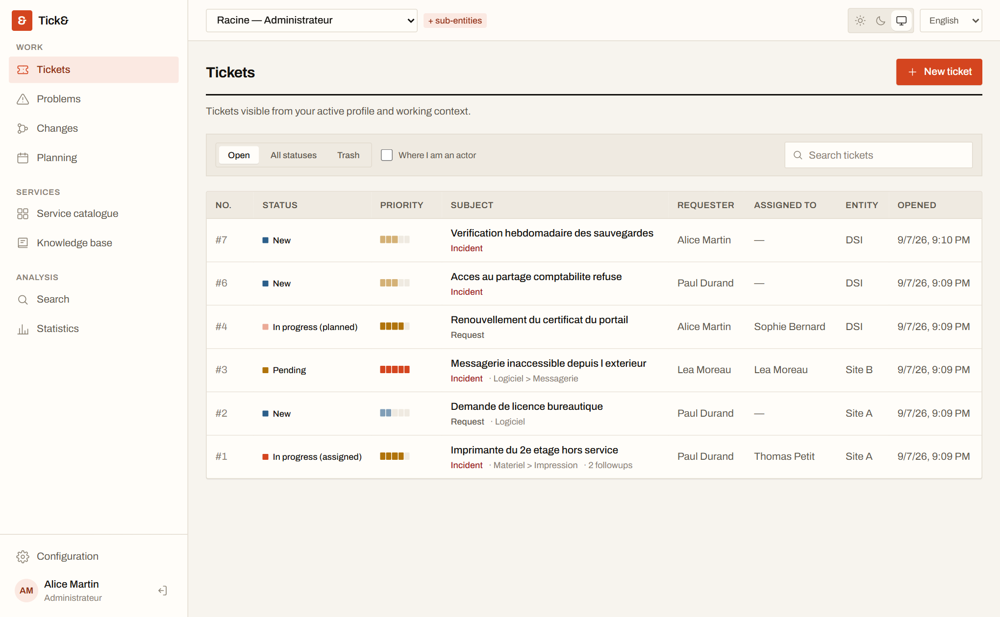
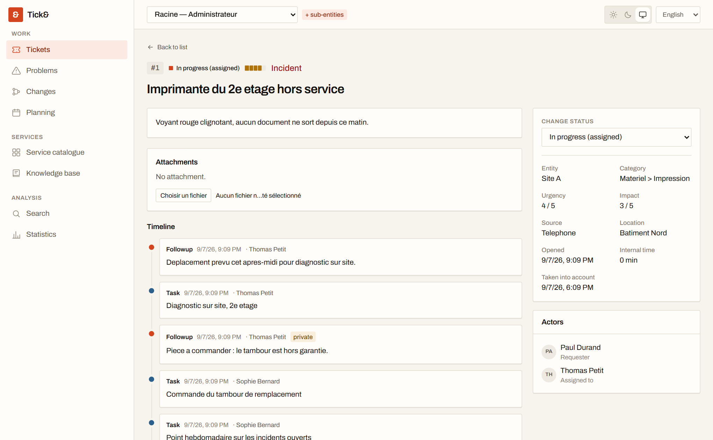
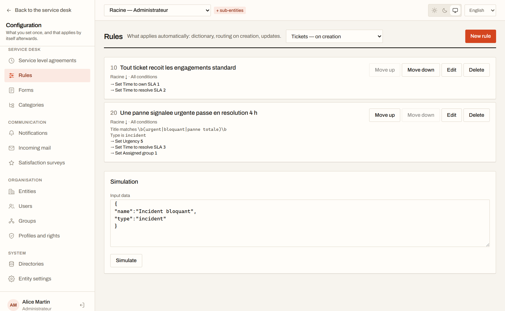
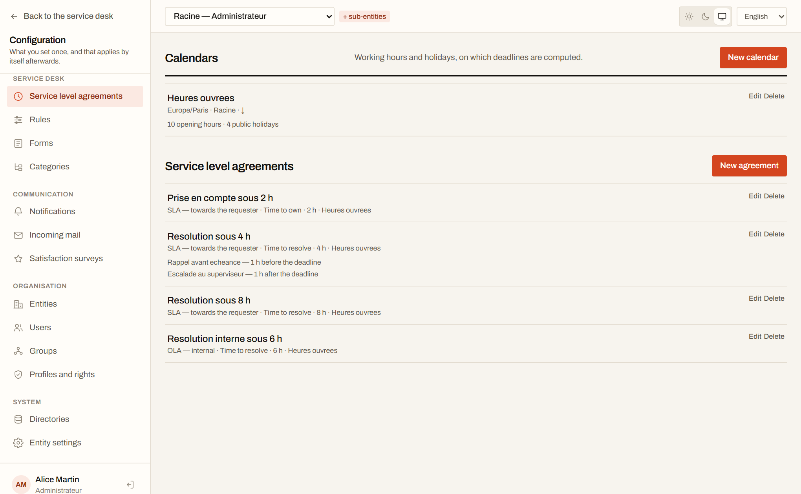
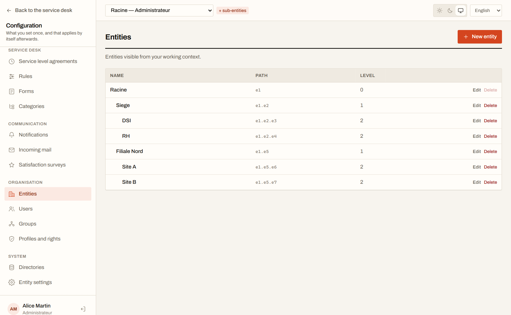

**English** · [Français](README.fr.md)

# Tick&

**Open-source, self-hosted ITSM ticketing.** Incidents, service requests, problems, changes,
service level agreements, automation rules, notifications, knowledge base, catalogue forms,
satisfaction surveys and a self-service portal — one tool, across an entire organisation. Asset
and inventory management is deliberately out of scope.

[](LICENSE)
[](https://github.com/tick0001/tick/actions/workflows/ci.yml)

**[tickand.fr](https://tickand.fr)** · **[Try the live demo](https://demo.tickand.fr)** — sign in as
`sophie` / `tick`. Everything resets on the hour.



---

## What it does

**Multi-organisation, enforced by the database.** Entities form a tree, and isolation rests on
PostgreSQL Row-Level Security — not on `WHERE` clauses somebody can forget to write. A right is a
triplet of object × action × scope, and a missing row means refusal.

**The full ITIL cycle.** Tickets, problems and changes share one foundation: actors, a unified
timeline, tasks, solutions, approvals, links between objects, promotion of an incident into a
problem.



**What actually runs a service desk.** Working-hour calendars and agreements with escalation, a
rule engine with a simulator, email notifications and an inbound collector, a knowledge base and
public FAQ, catalogue forms with display conditions, satisfaction surveys, planning, statistics
and dashboards, CSV and PDF exports.





**Extensible without forking.** Plugins load in-process, declare their permissions in a versioned
manifest, get their own PostgreSQL schema, and uninstall without leaving traces. See the
[SDK](docs/15-sdk-plugins.md).

**French and English** from day one, interface and emails alike.



## Deploy

```bash
git clone https://github.com/tick0001/tick.git && cd tick
cp .env.production.example docker/.env    # then fill in: secrets, URLs, SMTP
docker compose -f docker/compose.production.yaml up -d

# Create the first administrator — without it, nobody can sign in.
docker compose -f docker/compose.production.yaml run --rm \
  -e TICK_ADMIN_PASSWORD='…' api node dist/cli/initialiser.js
```

The environment file goes into `docker/`, next to the compose file: that is where Compose looks
for it, not at the root of the repository.

Images are pulled from `ghcr.io/tick0001/tick-api` and `ghcr.io/tick0001/tick-web`. Pin a version
with `TICK_VERSION` rather than following `latest`, so that an upgrade stays a decision.

Tick& expects to sit behind a TLS terminator — Caddy, Traefik, nginx — that presents the
certificate.

The [installation guide](docs/14-installation.md) covers the secrets to generate, the **mandatory**
rotation of the application role's password, backups and upgrades.

Containers not allowed on your servers? The bare-metal guides cover the same deployment from
release archives, on [Linux](docs/16-installation-linux.md) and on
[Windows Server](docs/17-installation-windows.md).

## Try it locally

Requirements: Node 22 or later, pnpm 11, Docker.

```bash
pnpm install
cp .env.example .env
pnpm services:up      # PostgreSQL, Redis, Mailpit, OpenLDAP
pnpm db:migrate       # schema, triggers, RLS policies
pnpm db:seed          # ⚠ demo dataset — truncates every table before writing
pnpm dev              # API on :3000, interface on :5173
```

Then <http://localhost:5173>, with `sophie` / `tick` — the account that sees the most without
being an administrator. Emails go to Mailpit, on <http://localhost:8025>.

`db:seed` is for **trying**, never for installing: it truncates every table. A real installation
uses `initialiser`, which creates the bare minimum.

<details>
<summary>Demo accounts — shared password <code>tick</code></summary>

Each one illustrates a case the entity model has to handle.

| Account     | Authorizations                                     | What it demonstrates                                      |
| ----------- | -------------------------------------------------- | --------------------------------------------------------- |
| `admin`     | Administrator on Racine, recursive                 | Full access to the tree                                   |
| `sophie`    | Supervisor on Filiale Nord, recursive              | A whole branch, without seeing headquarters               |
| `thomas`    | Technician on Site A, non-recursive                | A single entity, without its descendants                  |
| `lea`       | Technician on Site B **and** Self-service on Siege | Stacking: rights follow the active profile, never a union |
| `demandeur` | Self-service on DSI                                | The simplified interface                                  |

</details>

## Where the project stands

Milestones J0 to J8 of the [roadmap](docs/06-feuille-de-route.md) are delivered, and J9 all but
one point. The seventeen functional modules are covered, the API exposes 179 documented
operations, and the suite runs 2 295 tests — including integration tests against a real PostgreSQL
database that check isolation between entities.

What you should know before relying on it, said plainly:

- **Never used by a real service desk.** The public demo runs the released images on a VPS,
  behind Traefik with TLS, so the deployment path is exercised every day — but nobody has yet run
  Tick& to handle actual tickets.
- **`0.1.0` is a first tagged version, not a proven one.** Expect breaking changes between minor
  versions until the interfaces have been exercised by someone other than their author.
- **The plugin SDK is still `0.x`** and may break between minor versions. It will only freeze once
  every extension point has been exercised by real use; the reference plugin is not enough on its
  own.

Feedback, bug reports and trial plugins are useful now.

## Develop

```bash
pnpm build       # builds every package
pnpm test        # 2 295 tests — requires the services to be running
pnpm lint        # ESLint with type-aware rules
pnpm typecheck   # type checking without emit
pnpm format      # applies Prettier
pnpm db:reset    # back to a clean database, migrated and seeded
pnpm openapi     # exports the API description
```

The monorepo holds the API (NestJS), the interface (React + Vite), and four shared packages: Zod
contracts, the Drizzle data layer, translations, and the plugin SDK.

The reference plugin `plugins/exemple-bonjour` exercises every extension point and doubles as a
permanent integration test.

Commits are in French, short, prefixed with a gitmoji: `:sparkles: ajoute l'arbre des entités`.

## Design decisions

| Topic              | Decision                                                              |
| ------------------ | --------------------------------------------------------------------- |
| Backend            | NestJS (TypeScript)                                                   |
| Database           | PostgreSQL — `ltree`, `tsvector`, Row-Level Security                  |
| Data access        | Drizzle ORM, schema split per module                                  |
| Frontend           | React + Vite, Tailwind, TanStack Query & Table                        |
| Queues             | BullMQ + Redis                                                        |
| Plugins            | In-process, versioned manifest, semver SDK, one SQL schema per plugin |
| Multi-organisation | Hierarchical entities + PostgreSQL RLS                                |
| Deployment         | Self-hosted, single instance, Docker Compose                          |
| Authentication     | Local + LDAP / Active Directory                                       |
| Target scale       | A few hundred technicians, 100 to 500 k tickets a year                |

The reasoning behind each is argued in [the architecture document](docs/02-architecture.md).

## API

The OpenAPI description is served by the application itself, without authentication:

```
GET /api/openapi.json
```

It is **derived** from the controllers and the schemas they validate: it can neither omit an
existing route nor describe one that is gone. Every operation carries the right it requires.

## Documentation

The detailed documentation is written in French.

| Document                                                            | Contents                                                 |
| ------------------------------------------------------------------- | -------------------------------------------------------- |
| [Functional scope](docs/01-perimetre-fonctionnel.md)                | The 17 modules covered, in detail                        |
| [Architecture](docs/02-architecture.md)                             | Monorepo, backend, frontend, technical decisions argued  |
| [Entities, rights and security](docs/03-entites-droits-securite.md) | The multi-organisation model and its enforcement by RLS  |
| [Plugin system](docs/04-plugins.md)                                 | Manifest, hooks, lifecycle, isolation                    |
| [Plugin SDK](docs/15-sdk-plugins.md)                                | Reference for writing a plugin, with examples            |
| [Data model](docs/05-modele-de-donnees.md)                          | Core tables and conventions                              |
| [Service levels and rules](docs/07-niveaux-de-service-et-regles.md) | Working hours, agreements, escalation, rule engine       |
| [Communication](docs/08-communication.md)                           | Notifications, inbound email, satisfaction surveys       |
| [Self-service](docs/09-self-service.md)                             | Knowledge base, forms, requester interface               |
| [Problems and changes](docs/10-problemes-et-changements.md)         | Shared ITIL foundation, links between objects, promotion |
| [Steering](docs/11-pilotage.md)                                     | Planning, statistics, dashboards, exports                |
| [Interface](docs/12-interface.md)                                   | Colour tokens, navigation, shared building blocks        |
| [Administration](docs/13-administration.md)                         | Accounts, groups, profiles and the rights matrix         |
| [Installation and operations](docs/14-installation.md)              | Container deployment, backups, upgrades, troubleshooting |
| [Bare-metal install: Linux](docs/16-installation-linux.md)          | Without containers — system packages, systemd, nginx     |
| [Bare-metal install: Windows](docs/17-installation-windows.md)      | Without containers — Windows service, IIS                |
| [Roadmap](docs/06-feuille-de-route.md)                              | Ten milestones, from the foundation to public release    |

## Licence

**AGPL-3.0-or-later** — see [LICENSE](LICENSE).

Copyleft with a network clause: anyone hosting a modified version of Tick& must publish their
modifications, even without distributing the code.

No linking exception: a plugin is loaded into the API process and is very probably a derivative
work of it, and therefore subject to the same licence. Worth reading before writing a proprietary
plugin.

> Name: **Tick&** — technical identifier everywhere else: `tick` (`@tick/*` packages, Docker
> images, SQL schemas, API prefixes).
